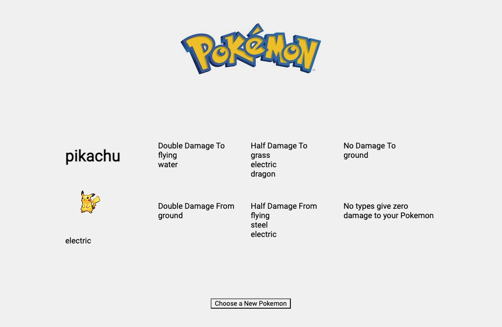

# pokeAPI-Project1

This is a project fetching information from a Pokemon API and displaying it for the user. There is an input search bar for the user where a pokemon name is filled, when submitted a fetch request is initiated. The data pulled is then displayed for the user, and based on the user's pokemon type, there is a second fetch initiated on the pokemon type (electric, fire, grass, etc.). When the second fetch happens, it displays information on a pokemons harm/damage taken and given to other pokemons based on their types. This information helps the user make a better choice when battling rival pokemon. This app is in the first version of development.

